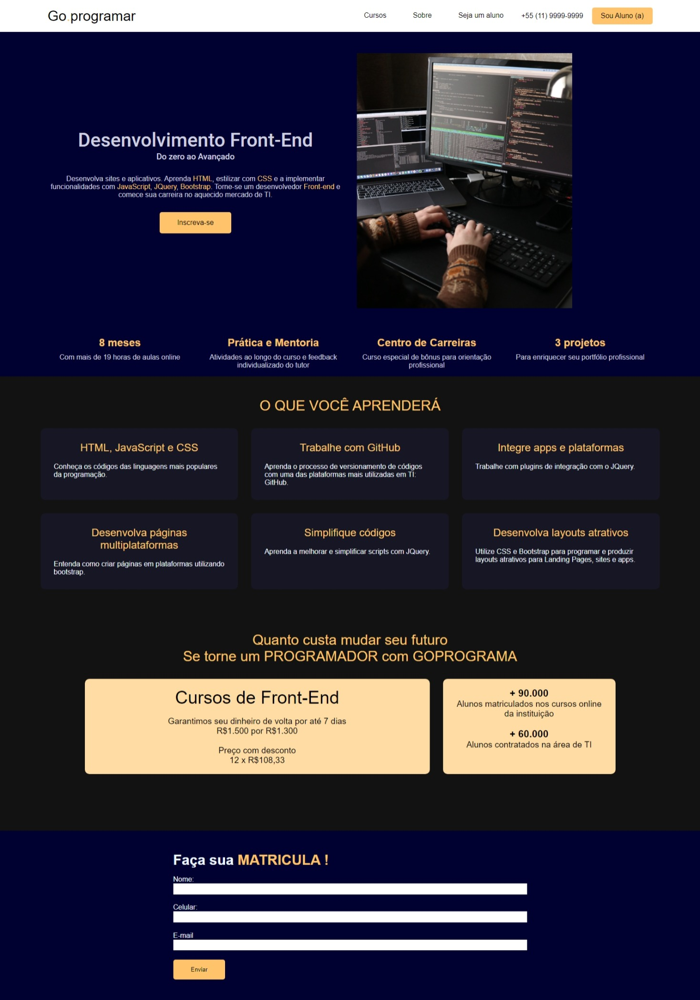

<h1>
   
</h1>

## 👩🏽‍💻 Sobre o Projeto Goprogramar 

 Site fictício

 No projeto **Curso** de **Front-end** do **GOPROGRAMA** eu trabalhei no desenvolvimento completo do **HTML** , **CSS** e **JavaScript do site. 

 - Funcionalidades 

 Este é um projeto que consiste em um formulário de matrícula que é validado em tempo real com JavaScript. Quando o usuário preenche os campos de nome, telefone e e-mail e clica em enviar, a validação é realizada para garantir que os campos foram preenchidos corretamente. Se houver algum erro, uma mensagem de erro é exibida na tela para o usuário. Se não houver erros, uma mensagem de sucesso é exibida e o formulário pode ser enviado. O projeto também inclui uma função que permite ao usuário exibir ou ocultar o menu mobile ao clicar no ícone do menu.

 Este projeto é pessoal e não foi desenvolvido no curso.

---
## 👩🏽‍💻 Tecnologia Utilizada

O projeto foi desenvolvido com as seguintes tecnologias

- HTML

- CSS

---
## 👩🏽‍💻 Acesse o projeto

<h3>
     <a href="https://lyrisnunes.github.io/goprogramar-curso/">- Veja o projeto</a>
</h3>

---
Desenvolvido por Lyris Nunes